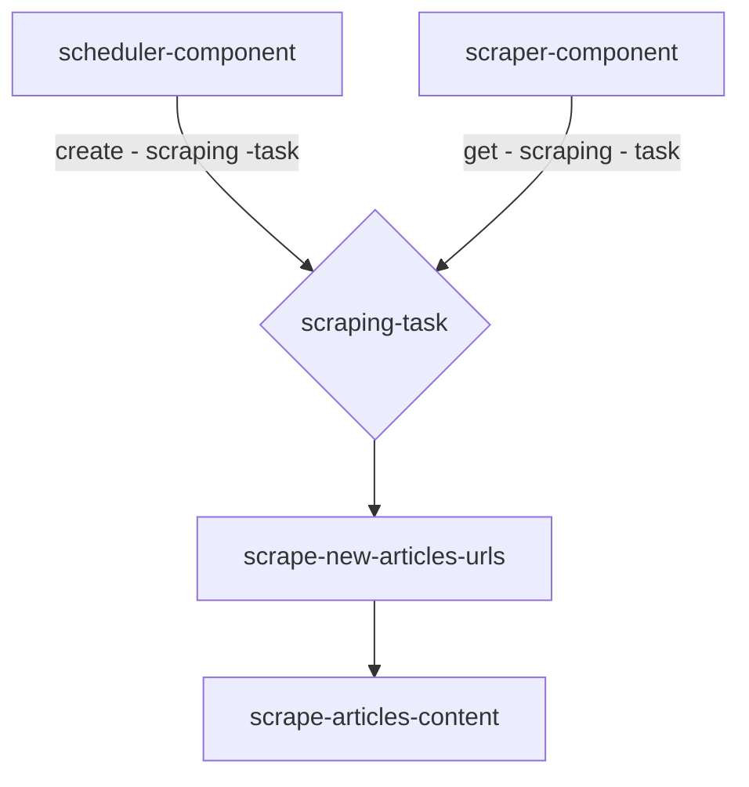

# Scraper Component

> ### <i>Scraper Flow</i>

> ### <i>Running Scraping Task</i>

1. get `pending` collecting task from db
2. get website scraper instance using factory
3. init scraper driver
4. get url page
5. get urls list
6. filter only new urls
7. for each url:
    1. get to url page
    2. collect article content
    3. save to db
    4. update task list of collected articles *
8. update task as `succeeded` or `failed`