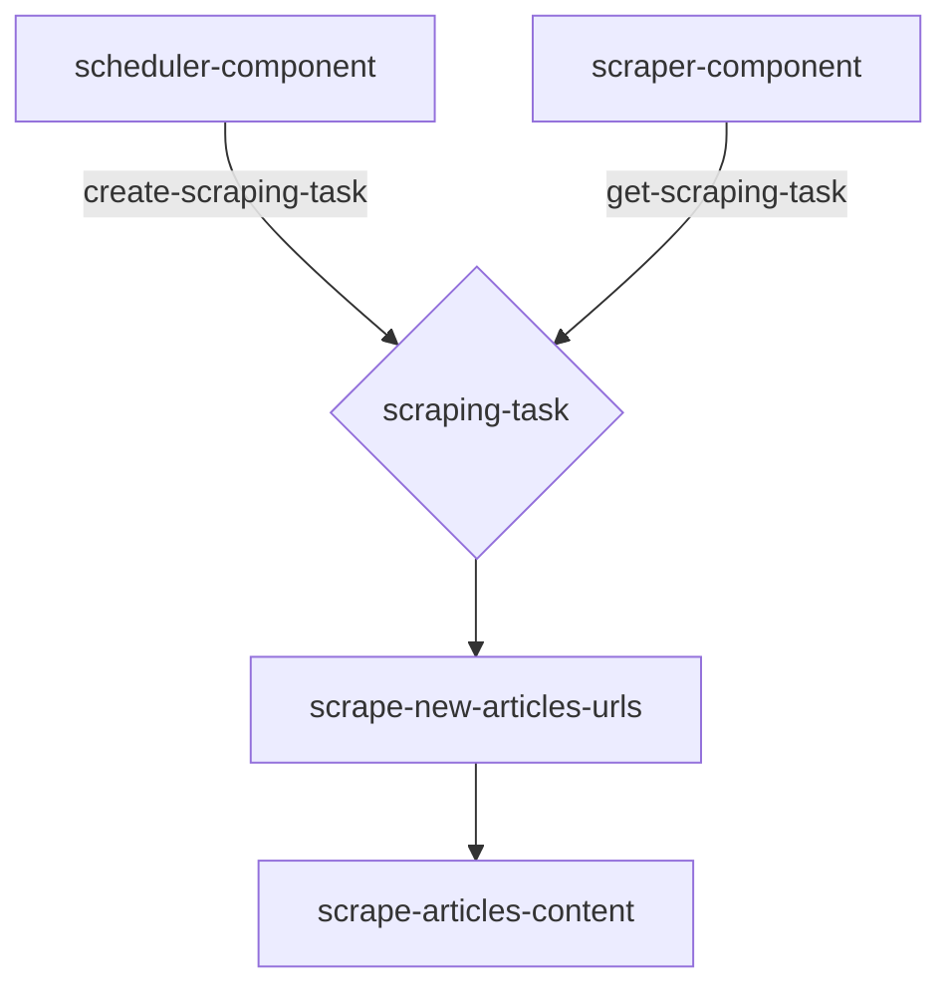

# Scraper Component

> ### Scraper flow

```mermaid
graph TD;
    scheduler-component-->|create-scraping-task| a{scraping-task};
    scraper-component-->|get-scraping-task| a{scraping-task};
    a{scraping-task}-->scrape-new-articles-urls
    scrape-new-articles-urls-->scrape-articles-content;
```
