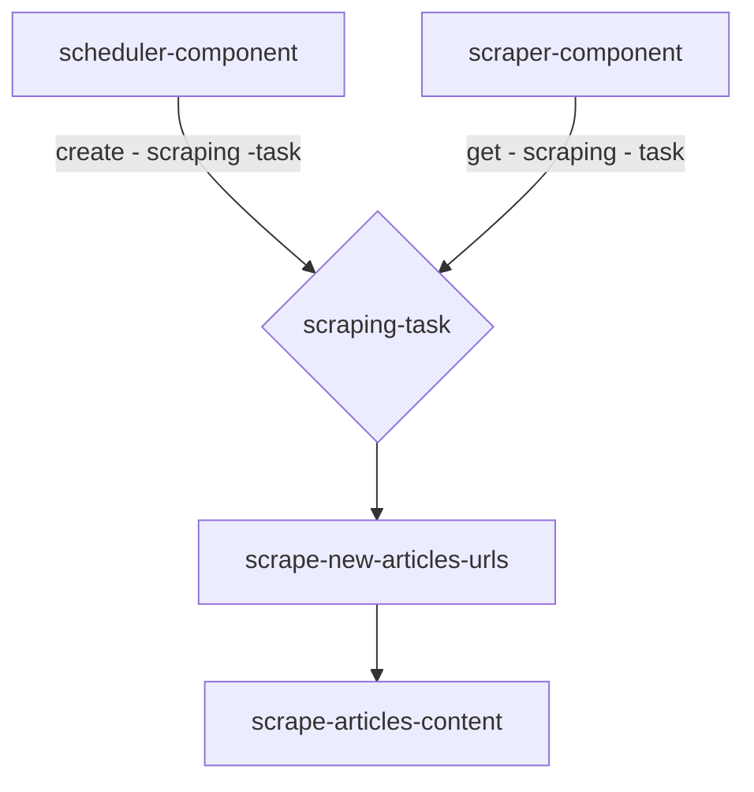

# Scraper Component

> ## <i>Scraper Flow</i>

> ## <i>Running Scraping Task</i>

### Type of task - `collect_urls`

1. get `pending` collecting task from db - if not found pending - get by `failed` status
2. set task status as `running`
3. get website scraper instance using factory
4. init scraper driver
5. get url page
6. get urls list
7. filter only new urls
8. for each new url - create new task for collecting content

### Type of task - `collect_article`

1. get `pending` collecting task from db - if not found pending - get by `failed` status
2. set task status as `running`
3. get website scraper instance using factory
4. init scraper driver
5. get url page (article)
6. collect article content
7. save to db
8. update task as `succeeded` or `failed`
