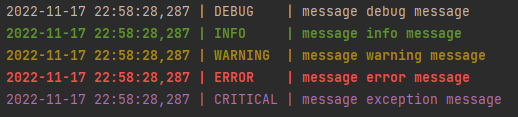

# server-logger

> Python module for logging

### Example of use:

```python
from server_logger import get_current_logger

logger = get_current_logger()
logger.debug("message debug message")
logger.info("message info message")
logger.warning("message warning message")
logger.error("message error message")
logger.exception("message exception message")
```

### Output:

